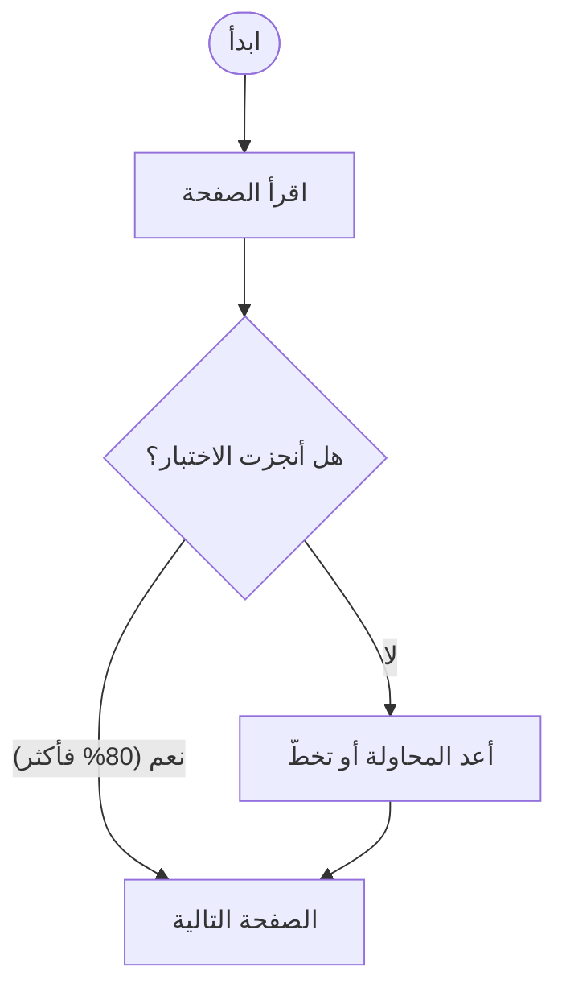
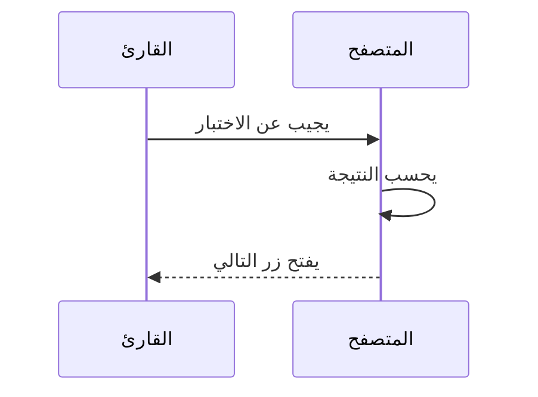
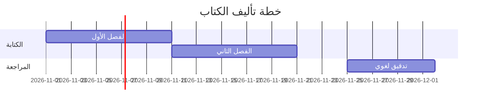
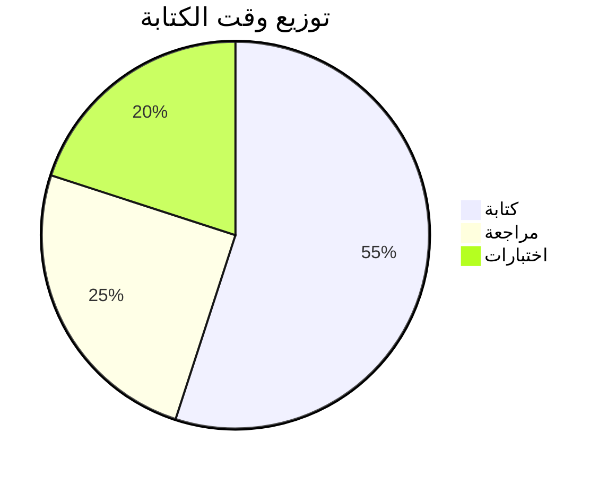

**مخطط انسيابي**

```mermaid
flowchart TD
    S([ابدأ]) --> R[اقرأ الصفحة]
    R --> Q{هل أنجزت الاختبار؟}
    Q -- "نعم (80% فأكثر)" --> N[الصفحة التالية]
    Q -- "لا" --> T[أعد المحاولة أو تخطَّ]
    T --> N
```

**مخطط تسلسل**

```mermaid
sequenceDiagram
    participant R as القارئ
    participant B as المتصفح
    R->>B: يجيب عن الاختبار
    B->>B: يحسب النتيجة
    B-->>R: يفتح زر التالي
```

**مخطط جانت لمشروع تأليف**

```mermaid
gantt
    title خطة تأليف الكتاب
    dateFormat YYYY-MM-DD
    section الكتابة
    الفصل الأول   :a1, 2026-11-01, 10d
    الفصل الثاني  :after a1, 10d
    section المراجعة
    تدقيق لغوي    :2026-11-25, 7d
```

**مخطط دائري**

```mermaid
pie title توزيع وقت الكتابة
    "كتابة" : 55
    "مراجعة" : 25
    "اختبارات" : 20
```
